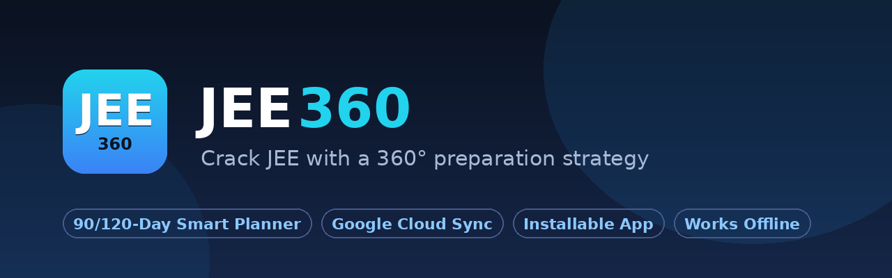

<div align="center">



<br><br>


# JEE360

### Crack JEE with a 360° preparation strategy 🎯

**Physics · Chemistry (OC / PC / IOC) · Mathematics — sab kuch ek jagah.**

<br>

[](https://smartstopwach.github.io/jee360/)
[](https://smartstopwach.github.io/jee360/)

[](https://smartstopwach.github.io/jee360/)
[](https://smartstopwach.github.io/jee360/)
[](https://smartstopwach.github.io/jee360/)
[](LICENSE)

<br>

**🌐 Live Site / Web App:** 👉 **[smartstopwach.github.io/jee360](https://smartstopwach.github.io/jee360/)** 👈

*Phone ya laptop pe kholo → "📲 Download App" dabao → home screen pe asli app ban jayegi!*

</div>

---

## ✨ Kya hai JEE360?

JEE Main & Advanced ke liye ek **complete smart study planner** — jo tumhare liye din-ba-din ka lecture schedule banata hai, tumhari speed ke saath khud adjust hota hai, aur tumhara saara progress **Google cloud pe safe** rakhta hai.

## 🚀 Features

### 📅 Smart Day-by-Day Planner
- **90 din (Fast)** ya **120 din (Recommended)** ka poora plan — ek-ek din ka goal
- Lecture speed choose karo: **1x / 1.25x / 1.5x**
- **Weekly mix** (roz 2 subjects) ya **One-subject-at-a-time** mode
- Chapter sequence kabhi nahi tootta — jo chapter shuru, wo pehle khatam
- **Apne chapters khud chuno** — jo pehle ho chuke unhe hatao, plan khud adjust
- Plan ke **beech mein bhi** chapters ghatao/badhao — bacha kaam aaj se re-pack

### ✅ Daily Progress Tracking
- Aaj ka goal: lectures + time + percentage progress bar
- Har lecture ke baad uska **DPP** (Lec 01 chhod ke) — alag amber colour mein
- **⏭ Next day** — aaj nahi ho paya? Kal us din ka load +1, baaki plan stable
- **⏫ Aaj karo** — kal ka lecture aaj karo, poora plan ek-ek upar shift
- **🔴 Backlog** — chhoota hua kaam khud agle din aata hai
- Galti se tick/move? **↩ Wapas / Un-done** — sab reversible
- Din **subah 3 baje** flip hota hai — raat 12-3 ki padhai usi din count 🌙

### ☁️ Google Cloud Sync
- **Sign in with Google** — ek click login
- Saara progress **real-time** Firestore pe save
- Phone pe tick karo → laptop pe **1-2 second mein live** update
- Device kho gaya? Login karo, sab wapas

### 📲 Progressive Web App (PWA)
- **Install karo** — Android, iOS, Windows, Mac sab pe
- **Offline chalta hai** — net nahi? Padhai mat roko, baad mein sync
- Cache-first speed — app bijli ki tarah khulti hai ⚡

## 📱 App Install Kaise Kare?

| Device | Tarika |
|--------|--------|
| **Android (Chrome)** | Site kholo → "📲 Download App" button → Install |
| **iPhone/iPad (Safari)** | Share (⬆️) → "Add to Home Screen" |
| **Laptop (Chrome/Edge)** | Address bar mein install icon (⊕) → Install |

## 🛠️ Tech Stack

- **Frontend:** Pure HTML + CSS + JavaScript (koi framework nahi — isliye super fast)
- **Auth:** Firebase Authentication (Google Sign-In)
- **Database:** Cloud Firestore (real-time sync)
- **PWA:** Service Worker + Web App Manifest
- **Hosting:** GitHub Pages (free forever)

## 📂 Project Structure

```
jee360/
├── index.html        # Front page (first-time users)
├── chapters.html     # Chapter selection (add/remove anytime)
├── planner.html      # 90/120 din + speed selection
├── study-mode.html   # Weekly mix vs One-subject mode
├── dashboard.html    # Daily planner + progress (main app)
├── data.js           # Saara syllabus data (chapters, lectures, DPPs)
├── sync.js           # Google login + real-time cloud sync
├── pwa.js            # Install button + service worker registration
├── sw.js             # Offline cache (service worker)
└── manifest.webmanifest
```

## 📄 License

MIT License — see [LICENSE](LICENSE).

<div align="center">
<br>

**Made with ❤️ for JEE aspirants**

**[🚀 Abhi shuru karo → smartstopwach.github.io/jee360](https://smartstopwach.github.io/jee360/)**

</div>
